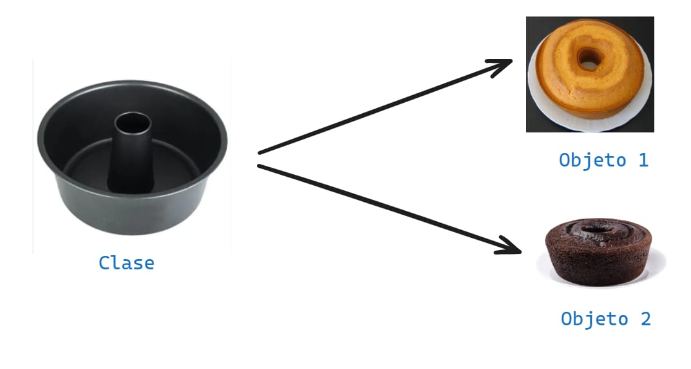

# 🚌POO - Programación Orientada a Objetos
La programación orientada a objetos - `POO` o en sus siglas en inglés `OOP`, es una manera de programar (paradigma*), permite llevar al código mecanismos usados con `entidades` de la vida real.

**Sus beneficios son los siguientes:**
1. Encapsulamiento: Permite `empaquetar` el código dentro de una unidad (objeto) dónde se puede determinar el ámbito de actuación .
2. Abstracción: Permite `generalizar` los tipos de objetos a través de las clases y simplificar el programa.
3. Herencia: Permite reutilizar código al poder heredar atributos y comportamientos de una clase.
4. Polimorfismo: Permite crear múltiples objetos a partir de una misma pieza flexible de código.
   
Existe 2 pilares más que a este nivel que están mis alumnitos van a pujar.

5. Acoplamiento
6. Cohesión

## ¿Qué es un objeto?
Un `objeto` es un tipo de dato estructuradoque contiene o almacena `datos` y `código`. 

|Elementos|Que son  |Como se llama|Como se identifica  |
|---------|---------|-------------|--------------------|
|Dato     |Variable |Atributo     |Mediante sustantivos|
|Código   |Función  |Método       |Mediante verbo      |

Un objeto representa una `instancia única` de una `entidad` a través de sus atributose interactuan con otros objetos o con sí mismo a través de sus métodos.

## ¿Qué es una clase?
Para crear un `objeto` primero debemos pensar en la `clase`.
Para responder la pregunta de Alex, debemos pensar en la `clase` como el `molde` con el que se crean nuevos objetos.
En el proceso diseño de una clase hay que tener en cuenta `el principio de responsabilidad única`, esto intentando que los `atributos` y los `métodos` esten enfocados en un objetivo único y bien definido.

> [!TIP]
> *Un paradigma de programación en un método, técnica o estilo de programar. Muchos de los lenguajes de programación son creados en base a un paradigma, ejemplo `java` es un lenguaje que adopta el paradigma `POO`(Programación Orientada a Objeto). Sin embargo existen lenguajes de programación que adoptan varios paradigmas como es el caso de python y javascript, estos son lenguajes multiparadigmas.
> 